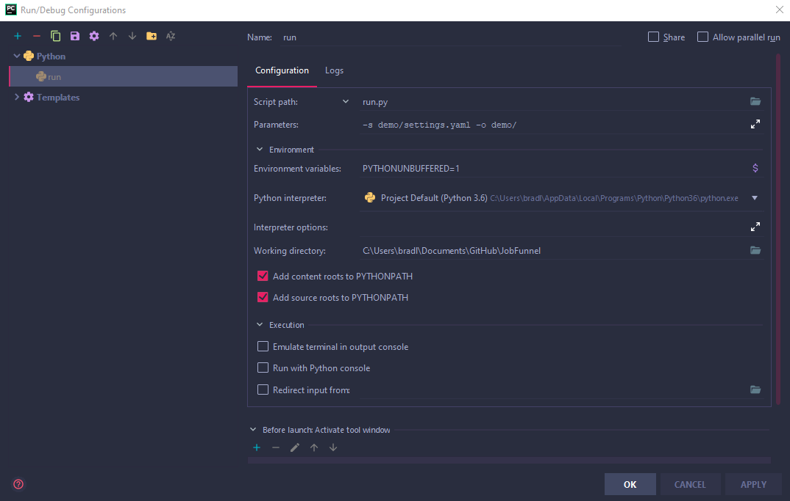

This document is a guide to developing this project with PyCharm.

### Installing PyCharm

Go to the JetBrains website for instructions on how to install.  
https://www.jetbrains.com/help/pycharm/installation-guide.html

### Installing Pipenv

Go to the Jetbrains website for instructions on how to install and set up pipenv.  
https://www.jetbrains.com/help/pycharm/pipenv.html

### Setting Debug Configurations

Do not follow these fields exactly.  However, if you go to _Run->Edit Configurations..._
make a new run configuration by clicking _+_.  Click _Python_ and fill in the fields
as shown below.  

